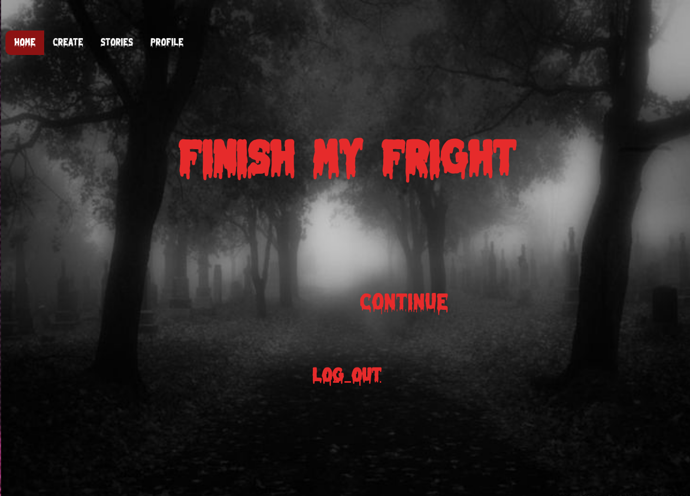
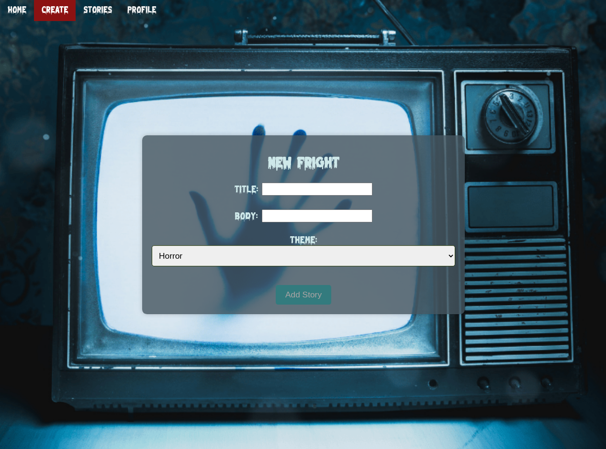
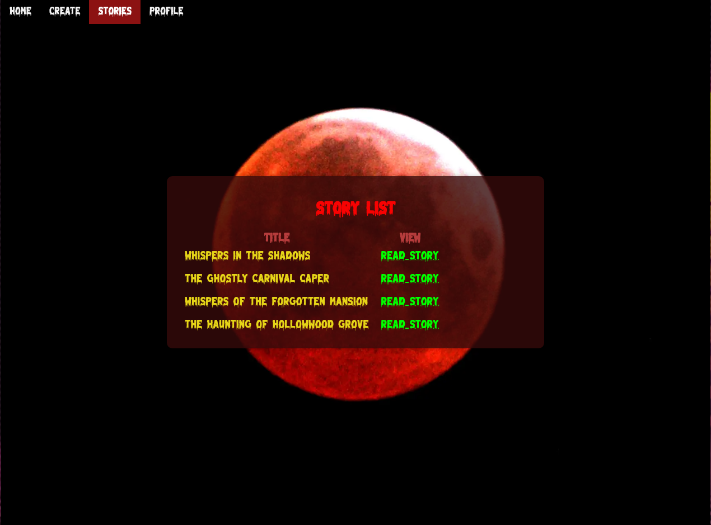
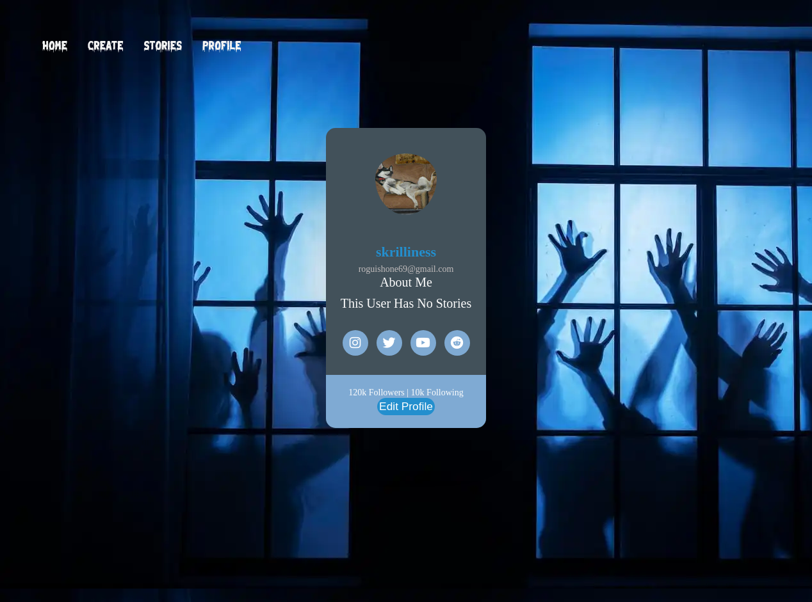
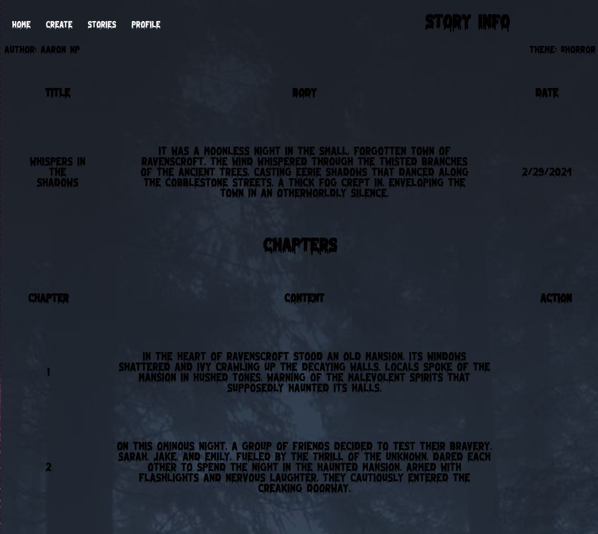

# Welcome to Finish My Fright

Welcome to **Finish My Fright**, your go-to destination for spine-chilling tales that will leave you on the edge of your seat! At *Finish My Fright*, we believe that the best scares come from the depths of imagination, which is why we're dedicated to bringing you an interactive platform where you can explore user-generated scary stories like never before.

As a guest user, you have access to a plethora of user-made scary stories, each more haunting than the last. But that's just the beginning. By creating an account, you unlock a world of possibilities. You can embark on your own terrifying journey by contributing to ongoing stories, picking up where the original author left off, or even creating your own spine-tingling tale from scratch.

But the fright doesn't end there. At *Finish My Fright*, we encourage creativity and collaboration. Users can rate stories, share their thoughts through comments, and immerse themselves in the eerie narratives that unfold online. Whether you're a seasoned storyteller or a horror enthusiast looking for your next thrill, **Finish My Fright** is the place to be.

So, join us if you dare, and prepare to lose yourself in a world of endless frights and hair-raising adventures. Your next nightmare awaits at **Finish My Fright**.

## Screenshots

<!-- Add more screenshots as needed -->

## Join us at 
### Finish-My-Fright [here](https://finishmyfright-b79c5c374288.herokuapp.com

## Tech Used 
### Programming Languages:
-JavaScript
### Web Development:
-HTML
-CSS
-EJS
### Server-side Development:
-Node.js
-Express
-MongoDB
-Mongoose
### Deployment and Hosting:
-Heroku
-Package Management:
-npm
### Version Control:
-Git
-Authentication:
-Google OAuth
### Front-end Framework:
-Bootstrap

## Ref
-Stack Overflow
- ['W3 Schools'](https://www.w3schools.com/graphics/default.asp)
- ['mdn'](https://developer.mozilla.org/en-US/docs/Web/API/Document_Object_Model/Introduction)
- ['Stack Overflow'](https://stackoverflow.com/questions/tagged/controller)

#### Trello Proj Planner
['Trello'](https://trello.com/b/3smybuWL/project-2)
